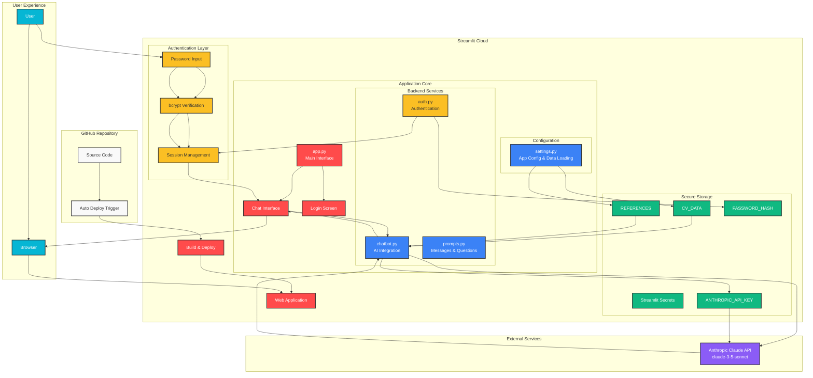

# Lebenslauf - CV Knowledge Assistant Chatbot

*Lebenslauf Wissensassistent* - A secure, password-protected chatbot that answers questions about your CV/professional background using Anthropic's Claude API.

## Architecture



### Key Components

1. **GitHub Integration**: Automatic deployment from repository updates
2. **Authentication System**: Secure bcrypt password hashing with session management
3. **AI Integration**: Claude 3.5 Sonnet for intelligent CV-based conversations
4. **Privacy-First Design**: Sensitive data stored in Streamlit secrets (never in code)
5. **Modern UI**: Clean, professional interface with responsive design

## Features

- 🔒 **Secure Access**: Password-protected via URL parameter or login form
- 💬 **Interactive Chat**: Modern chat interface with conversation history
- 🎨 **Beautiful UI**: Custom-styled Streamlit interface with dark theme
- 💰 **Cost Tracking**: Real-time token usage and cost estimation
- ⚡ **Fast Responses**: Uses Claude Haiku for quick, cost-effective responses
- 📱 **Responsive**: Works on desktop and mobile devices

## Quick Start

### 1. Setup Environment

```bash
# Clone this repository (make sure it's private!)
git clone https://github.com/Aldmorr/Lebenslauf.git
cd Lebenslauf

# Create virtual environment
python -m venv venv
source venv/bin/activate  # On Windows: venv\Scripts\activate

# Install dependencies
pip install -r requirements.txt
```

### 2. Configure Environment

```bash
# Copy the example environment file
cp .env.example .env

# Edit .env and add your credentials
ANTHROPIC_API_KEY=your_anthropic_api_key_here
ACCESS_PASSWORD=your_secure_password_here
```

### 3. Add Your CV Data

Edit `data/cv_data.txt` and replace the placeholder content with your actual CV information.

### 4. Run Locally

```bash
streamlit run app.py
```

The app will be available at `http://localhost:8501`

## Deployment Options

### Streamlit Community Cloud (Free)

1. Push your code to a **private** GitHub repository
2. Go to [share.streamlit.io](https://share.streamlit.io)
3. Connect your GitHub account and select your repository
4. Add your secrets in the Streamlit dashboard:
   - `ANTHROPIC_API_KEY`: Your Anthropic API key
   - `ACCESS_PASSWORD`: Your access password
5. Deploy and share the URL with `?token=your_password`

### Other Platforms

- **Railway.app**: Great for quick deployments
- **Render.com**: Free tier available
- **Heroku**: Reliable but paid

## Usage

### URL Access (Recommended)
Share this URL format with potential employers:
```
https://your-app.streamlit.app/?token=your_password
```

### Manual Login
Users can also visit the app directly and enter the password manually.

## Security Features

- Password protection via environment variables
- Session timeout (1 hour default)
- No persistent data storage
- Token usage tracking to prevent abuse
- Private repository requirement

## Customization

### Modify CV Data
Edit `data/cv_data.txt` with your information.

### Update Styling
Modify the CSS in `app.py` to match your preferred color scheme.

### Adjust Chatbot Behavior
Edit `backend/prompts.py` to customize the system prompt and responses.

### Change Model Settings
Modify `backend/chatbot.py` to use different Claude models or adjust token limits.

## Cost Estimation

The app uses Claude Haiku, which is very cost-effective:
- Input: $0.25 per 1M tokens
- Output: $1.25 per 1M tokens

Typical conversation costs are under $0.01 per session.

## File Structure

```
cv-chatbot/
├── app.py                 # Main Streamlit application
├── requirements.txt       # Python dependencies
├── .env.example          # Environment variables template
├── .gitignore           # Git ignore file
├── README.md            # This file
├── backend/
│   ├── __init__.py
│   ├── auth.py          # Authentication logic
│   ├── chatbot.py       # Anthropic API integration
│   └── prompts.py       # System prompts and messages
├── config/
│   └── settings.py      # Application configuration
└── data/
    └── cv_data.txt      # Your CV information
```

## Support

For issues or questions, please check the GitHub issues or create a new one in this private repository.

## License

This is a private project. All rights reserved.
